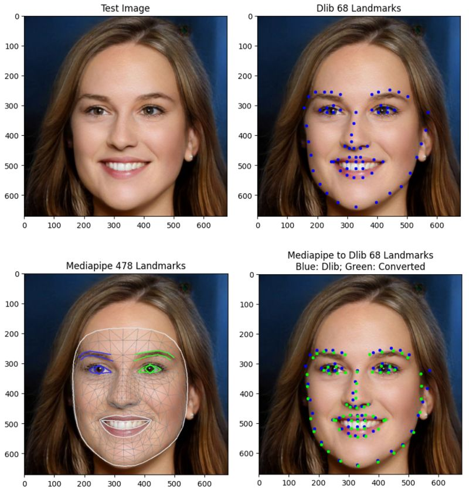

# Mediapipe to Dlib Face Landmarks Conversion

## [](https://opensource.org/licenses/MIT)

## Install
```
pip install .
```

## Usage

```
from mediapipe2dlib.mp2dlib import convert_landmarks_mediapipe_to_dlib

# Convert Mediapipe dense landmarks to Dlib sparse landmarks
lmks_mp2dlib = convert_landmarks_mediapipe_to_dlib(lmks_mp)
```

## Example


